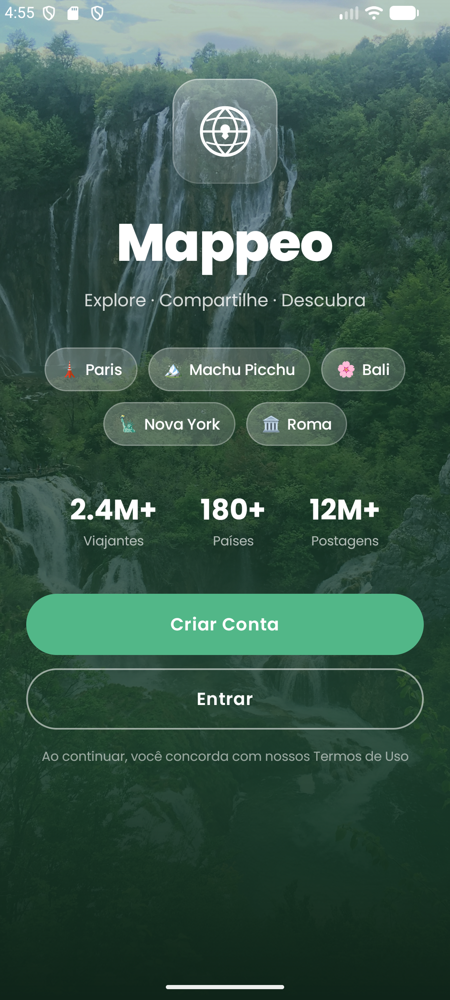

# 🌍 Mappeo

> **Explore. Compartilhe. Descubra.**

Mappeo é uma rede social mobile baseada em geolocalização, onde usuários podem explorar e compartilhar locais turísticos ao redor do mundo. Visualize destinos no mapa, crie postagens com mídia, interaja com outros viajantes e descubra novos lugares.

---

## 📱 Screenshots

| Boas-vindas |
|:-----------:|
|  |

---

## ✨ Funcionalidades

- 🗺️ **Mapa interativo** com locais turísticos em tempo real
- 📸 **Postagens com mídia** — fotos e vídeos de destinos
- 🔐 **Autenticação segura** via Firebase Auth
- 👥 **Rede social** — curtidas, comentários e seguidores
- 📍 **Geolocalização GPS** para descobrir o que está por perto
- 🔔 **Notificações push** de interações e novos locais
- 🌐 **2.4M+ viajantes** · 180+ países · 12M+ postagens

---

## 🛠️ Stack Tecnológica

| Camada | Tecnologia |
|--------|-----------|
| Linguagem | Kotlin |
| UI | Jetpack Compose |
| Arquitetura | Clean Architecture + MVVM |
| Injeção de dependência | Hilt |
| Navegação | Navigation Compose |
| Backend | Firebase (Auth, Firestore, Storage) |
| Mapas | Google Maps SDK |
| Async | Coroutines + Flow |
| Build | Gradle (Kotlin DSL) |

---

## 🏗️ Arquitetura

O projeto segue **Clean Architecture** com separação clara de responsabilidades:

```
app/src/main/java/com/mappeo/app/
│
├── presentation/          # UI (Compose) + ViewModels
│   ├── welcome/
│   ├── login/
│   ├── register/
│   ├── home/
│   ├── map/
│   └── profile/
│
├── domain/                # Regras de negócio (UseCases + Entities)
│   ├── model/
│   ├── repository/
│   └── usecase/
│
├── data/                  # Implementação de repositórios + fontes de dados
│   ├── remote/
│   ├── local/
│   └── repository/
│
├── ui/                    # Componentes reutilizáveis e tema
│   ├── components/
│   └── theme/
│
└── navigation/            # Rotas e NavGraph
```

### Fluxo de dados

```
UI (Compose)
    └── ViewModel
            └── UseCase (Domain)
                    └── Repository (interface)
                            └── RemoteDataSource / LocalDataSource
```

---

## 🚀 Como rodar o projeto

### Pré-requisitos

- Android Studio Hedgehog (2023.1.1) ou superior
- JDK 17+
- Android SDK 35
- Conta no [Firebase Console](https://console.firebase.google.com)

### Configuração

**1. Clone o repositório**
```bash
git clone https://github.com/unlovedbunny/mappeo.git
cd mappeo/mobile
```

**2. Configure o Firebase**

- Crie um projeto no [Firebase Console](https://console.firebase.google.com)
- Ative **Authentication** (Email/Senha + Google)
- Ative **Firestore Database**
- Ative **Storage**
- Baixe o arquivo `google-services.json`
- Cole em `app/google-services.json`

**3. Configure o Google Maps**

- Ative a **Maps SDK for Android** no [Google Cloud Console](https://console.cloud.google.com)
- Adicione sua chave no `local.properties`:
```properties
MAPS_API_KEY=sua_chave_aqui
```


**5. Execute**
```bash
./gradlew assembleDebug
```
Ou pressione ▶ no Android Studio.

---

## 🎨 Design System

### Paleta de cores

| Token | Hex | Uso |
|-------|-----|-----|
| `Green800` | `#2D6A4F` | Cor primária |
| `Green500` | `#52B788` | Destaque / botões |
| `Green100` | `#D8F3DC` | Fundo claro |
| `Green900` | `#1B4332` | Textos escuros |

### Componentes reutilizáveis

- `PrimaryButton` — botão principal verde
- `SecondaryButton` — botão outline translúcido
- `MappeoLogoBox` — logo com efeito glassmorphism
- `LocationChip` — pill de destino translúcido
- `StatItem` — exibição de métricas
- `AuthTextField` — campo de texto para login/cadastro
- `LoadingOverlay` — overlay de carregamento
- `TopBlurBackground` — fundo com blur no topo

---

## 📋 Telas planejadas

| # | Tela | Status |
|---|------|--------|
| 1 | Splash / Boas-vindas | ✅ Concluída |
| 2 | Login | 🔄 Em desenvolvimento |
| 3 | Cadastro | 🔄 Em desenvolvimento |
| 4 | Home (Feed) | ⏳ Planejada |
| 5 | Mapa | ⏳ Planejada |
| 6 | Criar postagem | ⏳ Planejada |
| 7 | Detalhes do local | ⏳ Planejada |
| 8 | Perfil do usuário | ⏳ Planejada |
| 9 | Configurações | ⏳ Planejada |

---

## 🤝 Contribuindo

1. Faça um fork do projeto
2. Crie uma branch para sua feature
```bash
git checkout -b feature/nome-da-feature
```
3. Faça commit das suas alterações
```bash
git commit -m "feat: descrição da feature"
```
4. Faça push para a branch
```bash
git push origin feature/nome-da-feature
```
5. Abra um Pull Request

---

## 📄 Licença

Este projeto está sob a licença MIT. Veja o arquivo [LICENSE](LICENSE) para mais detalhes.

---

## 👩‍💻 Autora

Desenvolvido por **Duda** como projeto acadêmico.

---

*Feito com 💚 e Kotlin*
